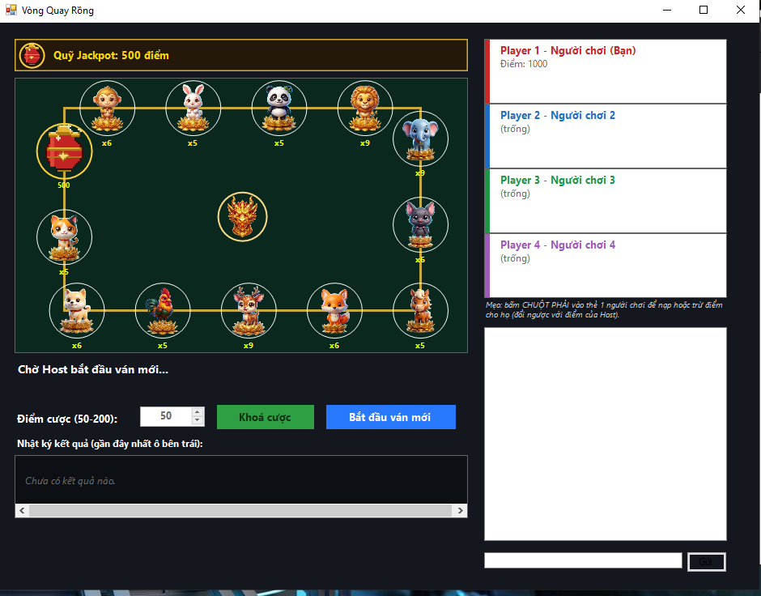

# Vòng Quay Rồng

<p align="center">
  
</p>

Trò chơi vòng quay 12 con vật nhiều người chơi qua mạng LAN hoặc Online.
Mỗi ván đặt cược vào 1 con vật (hoặc ô Nổ Hũ), Host quay ngẫu nhiên có
trọng số — trúng thì nhân hệ số, trật thì mất cược. Kiến trúc star-topology
(NetworkHub.vb / NetworkPeer.vb), Host điều phối toàn bộ vòng quay và kết
quả.

# Các tính năng chính
- Hỗ trợ nhiều người chơi cùng lúc qua mạng LAN/Online
- 12 con vật với 3 mức hệ số thưởng, trọng số quay cân bằng RTP giữa các con
- **Ô Nổ Hũ** (Jackpot): sự kiện hiếm, người trúng chia nhau toàn bộ quỹ tích lũy
- Quỹ Jackpot tăng dần mỗi ván (10% mỗi cược được góp vào — không trừ điểm người chơi)
- Mỗi người bắt đầu với **1000 điểm**, đặt cược **50–200 điểm/ván**
- Sprite 12 con vật + Rồng từ thư mục Assets (tự vẽ hình tròn màu nếu thiếu ảnh)

# 12 Con vật & hệ số thưởng
| Hệ số | Con vật | Độ hiếm |
|-------|---------|---------|
| ×5 | Thỏ, Gấu trúc, Ngựa, Gà trống, Mèo | Thường |
| ×6 | Khỉ, Dơi, Cáo, Chó | Khá |
| ×9 | Sư tử, Voi, Hươu | Hiếm |

> Trọng số quay tính theo `90 / HeSo` — con vật hệ số cao xuất hiện ít hơn
> nhưng kỳ vọng hoàn trả (RTP) tương đương nhau giữa tất cả con vật.

# Ô Nổ Hũ (Jackpot)
- Quỹ khởi đầu: **500 điểm**, tăng dần mỗi ván
- Mỗi cược góp thêm **10%** vào quỹ (tiền nhà cái bù, không trừ người chơi)
- Xác suất ra Nổ Hũ rất thấp (trọng số = 6, thấp hơn nhiều so với các con vật)
- Khi Nổ Hũ: những ai đặt vào ô Nổ Hũ **chia đều** toàn bộ quỹ; ai đặt con vật khác mất cược bình thường
- Sau khi vỡ hũ: quỹ reset về **500 điểm**

# Cách tính thắng/thua
| Kết quả | Điểm nhận |
|---------|-----------|
| Trúng con vật | +Cược × HeSo |
| Trúng Nổ Hũ | Chia đều quỹ Jackpot |
| Trật | -Cược |

# Cách build
Yêu cầu: **.NET Framework 4.x** đã cài sẵn trên Windows.

```
buildexe_vongquayrong.bat
```

File `.exe` xuất ra cùng thư mục với tên `VongQuayRong.exe`.

> Đặt thư mục `Assets/` (chứa `khi.png`, `tho.png`, `gautruc.png`, `sutu.png`,
> `voi.png`, `doi.png`, `ngua.png`, `cao.png`, `huou.png`, `gatrong.png`,
> `cho.png`, `meo.png`, `Rong.png`) cạnh file `.exe` để hiển thị sprite.

# Cách chơi

**Host (tạo phòng):**
1. Chọn **Tạo phòng** → nhập port (mặc định `9988`) → bấm Host
2. Chờ người chơi khác vào phòng
3. Bấm **Quay** để bắt đầu mỗi ván sau khi mọi người đặt cược

**Client (vào phòng):**
1. Chọn **Vào phòng** → nhập IP của Host và port → bấm Join
2. Chọn con vật muốn cược + số điểm → bấm **Đặt cược**
3. Chờ Host quay và xem kết quả

# Cấu trúc file
| File | Vai trò |
|------|---------|
| `VongQuayRongGame.vb` | Logic game: 12 con vật, quay có trọng số, tính thưởng, Jackpot |
| `Form1.vb` | Giao diện, vẽ vòng quay, animation, đặt cược |
| `NetworkHub.vb` | Phía Host: quản lý nhiều kết nối Client (star-topology) |
| `NetworkPeer.vb` | Phía Client: kết nối đến Host |
| `Program.vb` | Entry point |
| `buildexe_vongquayrong.bat` | Script build bằng vbc.exe |
